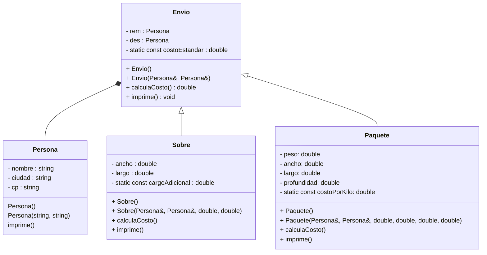

# Ejercicio-Autograding para C++ usando Catch2

**Fuente:** *Learning Autograding with C/C++ and Catch2 - Prof. Igor Machado Coelho* 
https://medium.com/swlh/easy-c-autograding-on-github-classroom-with-catch2-106ad1107402

## Descripción del Problema

Resolver situaciones reales empleando los conceptos de herencia y polimorfismo, modificadores de acceso, sobrecarga y sobreescritura de métodos

## Ejecución

En la actividad anterior, desarrollaste lo siguiente:

- Una jerarquía de herencia para representar los diferentes tipos de paquetes: clase Envio como clase base de la jerarquía, las clases Sobre y Paquete derivadas de Envio y para manejar el remitente y destinatario una clase Persona.

En esta tarea seguiremos con esa jerarquía de clases y tendremos que hacer lo siguiente:

- En el repositorio ya tienes completas las clases: Persona.hpp  Persona.cpp  Envio.hpp  Envio.cpp  Paquete.hpp  Paquete.cpp  Sobre.hpp  Sobre.cpp. Así mismo tienes el exercise.cpp, en este main debes completar el código que te piden. Pero primero realiza el siguiente cambio en las clases:

    * El método **calculaCosto()** e **imprime()** deben actuar polimórficamente (en tiempo de ejecución). Realiza lo necesario para que se comporten de esta manera.
    * El **exercise.cpp** deberá ser completado de acuerdo a las instrucciones que vienen en el archivo, las instrucciones están como comentarios y están numeradas.
    * En tu repositorio también está este archivo de texto: **datosEnvio.txt**. Revísalo para que veas el formato que tiene.

La lectura se espera de forma simple donde se considera como separador el espacio, es por esto que los nombres los ves como Pedro_Rosas para que los considere como un solo dato. 

El orden de los datos del archivo son de la siguiente manera, si es **Paquete**:

´´´p nombreRemitente CiudadRemitente CPRemitente nombreDestinatario CiudadDestinatario CPDestinatario peso ancho largo profundidad´´´

Si es un **Sobre**:

´´´s nombreRemitente CiudadRemitente CPRemitente nombreDestinatario CiudadDestinatario CPDestinatario largo ancho´´´

## Diagrama de Clases

## Objetivo

- Busca que el código pase correctamente todas las pruebas
   * Solamente cambia los archivos permitidos para lograr este objetivo (abajo se indican las reglas específicas)
   
- Las GitHub Actions deberán presentar una palomita en verde si se han satisfecho todas las pruebas, y una cruz roja cuando alguna (o todas) las pruebas han fallado.
   * **Recomendación:** Puedes dar clic en la cruz roja para verificar cual de las pruebas ha fallado (o si el código no ha compilado correctamente).
   * **Recomendación:** En caso de que el Autograding no muestre pruebas o no funcione, contacta a tu profesor mediante un issue.

## Instrucciones

- Deberás modificar SOLAMENTE los archivos que son necesario con respecto a la actividad` !
  * En el archivo `excersice.cpp` agrega el código que te pide.

Explicación de los otros archivos:

- Archivo `test/tests.cpp` tiene las pruebas de esta actividad (NO LO CAMBIES!)
- Archivo `test/catch.hpp` tiene la biblioteca de pruebas  CATCH2 (NO LA CAMBIES!)
- Archivo `makefile` tienes los comandos para ejecutar la actividad (NO LO CAMBIES!)
- Archivo  `./build/appTests` se generará después de compilar (para **pruebas locales**, solo ejecútalo)

## Comandos para pruebas locales, ejecución y depuración

- Comando para construir y ejecutar pruebas: `make` o `make test`
    * Si el ejecutable ya está construido, sólo teclea : `./build/appTests`

- Comando para construir y ejecutar la aplicación: `make run` 
    * Si el ejecutable ya está construido, sólo teclea : `./build/exercise`

- Comando para depurar: `make debug`
    * Para conocer los comandos de depuración consulta:
     https://u.osu.edu/cstutorials/2018/09/28/how-to-debug-c-program-using-gdb-in-6-simple-steps/
     

## Notas

- El código será evaluado solamente si compila.
   * La razón de esto es, si no compila no es posible generar el ejecutable y realizar las pruebas.

- Algunos casos de prueba podrían recibir calificación individual, otros podrían recibir calificación y si pasan todos juntos (o todas las pruebas en conjunto).

- La calificación final se otorgará de manera automática en cada *commit*, y se evaluará solamente hasta la fecha limite de la actividad.

Para dudas adicionales, consulta a tu profesor.

## License

MIT License 2020
